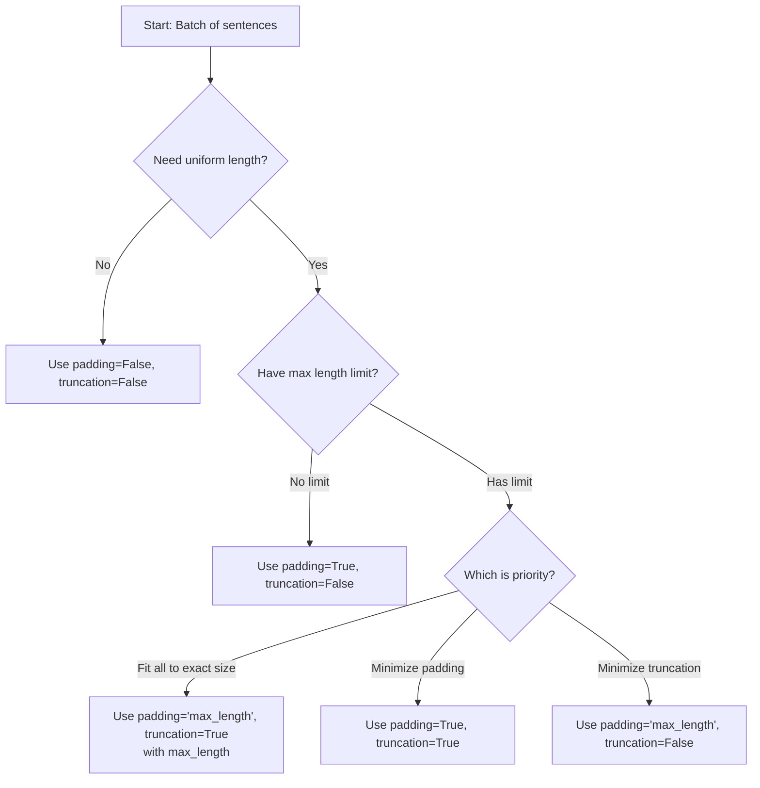

# Padding and Truncation - Simple Explanation

## **The Core Problem**

When processing multiple sentences together (in a "batch"), they often have different lengths:

```
Sentence 1: "I love cats"                     (3 words)
Sentence 2: "The weather is really nice today" (6 words)  
Sentence 3: "Hello"                            (1 word)
```

Computers need **uniform-sized tensors** (rectangular arrays of numbers) for efficient processing. Different lengths = incompatible for batch processing.

---

## **Two Simple Solutions**

### **1. Padding - Make shorter sentences longer**
**What it does:** Adds special "padding tokens" (like empty filler) to shorter sentences.

**Example with padding token `[PAD]`:**
```
Original sentences:          After padding (to longest):
"I love cats"                "I love cats [PAD] [PAD] [PAD]"
"The weather is really..."   "The weather is really nice today"
"Hello"                      "Hello [PAD] [PAD] [PAD] [PAD] [PAD]"
```
→ All become 6 words long.

### **2. Truncation - Make longer sentences shorter**
**What it does:** Cuts off extra words from longer sentences.

**Example (max 3 words):**
```
Original sentences:          After truncation:
"I love cats"                "I love cats"        (unchanged)
"The weather is really..."   "The weather is"     (cut after 3 words)
"Hello"                      "Hello"              (unchanged)
```
→ All become ≤3 words.

---

## **How to Use in Code**

### **The Three Key Arguments:**
1. `padding` - Controls padding behavior
2. `truncation` - Controls truncation behavior  
3. `max_length` - Sets maximum length (optional)

---

### **Padding Options:**

| Code | What it does | Example |
|------|--------------|---------|
| `padding=True` or `padding='longest'` | Pad to longest sentence in current batch | Batch of 4, 6, 8 words → all become 8 words |
| `padding='max_length'` | Pad to specific or model max length | All become exactly `max_length` words |
| `padding=False` or `padding='do_not_pad'` | No padding (default) | Keep original lengths |

**Example:**
```python
# Pad to longest in this batch
tokenizer(sentences, padding=True)

# Pad to exactly 50 words
tokenizer(sentences, padding='max_length', max_length=50)
```

---

### **Truncation Options:**

| Code | What it does | Best for |
|------|--------------|----------|
| `truncation=True` or `truncation='longest_first'` | Cut from longest sentence until fits | Single sentences |
| `truncation='only_second'` | Only truncate second sentence | Question-Answer pairs |
| `truncation='only_first'` | Only truncate first sentence | Text pairs where first is more important |
| `truncation=False` or `truncation='do_not_truncate'` | No truncation (default) | When length doesn't matter |

**Example:**
```python
# Truncate if longer than model can handle
tokenizer(sentences, truncation=True)

# Truncate to exactly 100 words
tokenizer(sentences, truncation=True, max_length=100)
```

---

## **Common Combinations - Quick Recipes**

### **Recipe 1: Standard Batch Processing**
```python
# Pad to batch's longest, truncate if exceeds model limit
tokenizer(batch, padding=True, truncation=True)
```
**Use when:** Processing multiple sentences together.

---

### **Recipe 2: Fixed Length**
```python
# Force all to exactly 128 tokens
tokenizer(batch, padding='max_length', truncation=True, max_length=128)
```
**Use when:** You need uniform input size for your model.

---

### **Recipe 3: Just Truncate**
```python
# Only ensure nothing exceeds limit, keep different lengths
tokenizer(batch, truncation=True)
```
**Use when:** You want minimal padding.

---

### **Recipe 4: Natural Lengths**
```python
# Keep everything as-is (no padding/truncation)
tokenizer(batch, padding=False, truncation=False)
```
**Use when:** Processing sentences individually or with custom handling.

---

## **Visual Decision Guide**



---

## **Real-World Analogy**

Think of **organizing books on shelves**:

- **Padding** = Adding empty bookends 📚➡️📚⚪⚪⚪
- **Truncation** = Removing extra books 📚📚📚📚📚➡️📚📚📚
- **Max length** = Shelf size limit

**Common scenarios:**
- Library (fixed shelves): `padding='max_length', truncation=True`
- Home collection (flexible): `padding=True, truncation=True`
- Rare books (no cutting): `padding=True, truncation=False`

---

## **Pro Tips**

1. **Model limits matter:** Most models have maximum lengths (often 512 tokens). Check your model's specs.
2. **Padding side:** Usually padding is added at the end, but some models need it at the beginning.
3. **Padding token ID:** The tokenizer automatically uses the correct padding token ID for the model.
4. **Batch efficiency:** Uniform lengths = faster processing.

---

## **Quick Reference Table**

| Your Goal | Recommended Code |
|-----------|------------------|
| Process batch efficiently | `padding=True, truncation=True` |
| Force exact size | `padding='max_length', truncation=True, max_length=128` |
| Ensure no overflow | `truncation=True` |
| Keep natural lengths | `padding=False, truncation=False` |
| Pad to multiples of 8 (for GPUs) | `padding=True, pad_to_multiple_of=8` |

**Remember:** Start with `padding=True, truncation=True` for most cases. Adjust based on your specific needs!
